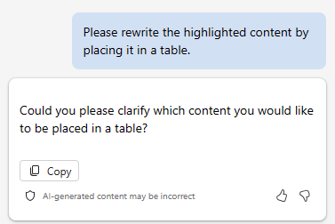
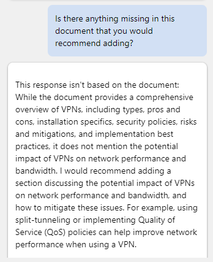

Word의 Microsoft 365 Copilot을 사용하여 기술 보고서 업데이트
---
Word의 Microsoft 365 Copilot은 IT 전문가가 문서를 보다 효율적으로 작성하는 데 도움이 되는 AI 기반 문서 작성 도우미입니다. 새 문서를 만들거나 기존 문서에서 작업할 때 Copilot은 다양한 방법으로 도움을 줄 수 있습니다.

 -  새로운 빈 문서에서 또는 기존 문서에 콘텐츠를 추가하려는 경우 Copilot에 작성하려는 콘텐츠를 알려 주면 그에 따라 콘텐츠가 생성됩니다. 예를 들어, Copilot에게 "클라우드 컴퓨팅의 이점에 대한 에세이 작성" 또는 "사이버 보안의 중요도에 대한 단락 작성"이라고 말할 수 있습니다. 원하는 경우 Copilot 초안이 작성되는 콘텐츠를 기반으로 하는 입력으로 최대 3개의 기존 파일을 포함할 수 있습니다. 또는 Copilot은 공용 웹 데이터를 기반으로 새 콘텐츠를 생성할 수 있습니다.
 -  기존 콘텐츠가 있는 문서에서 Copilot은 콘텐츠를 변환하는 데 도움을 줄 수 있습니다. 선택한 콘텐츠를 다시 쓰거나 선택한 콘텐츠를 테이블로 변환할 수도 있습니다.

전반적으로 Word의 Microsoft 365 Copilot은 IT 전문가가 문서를 작성할 때 시간과 활동을 절약하는 데 도움이 될 수 있습니다. 콘텐츠를 생성하고, 텍스트를 다시 작성하고, 유용한 제안을 제공하는 데 도움이 될 수 있습니다. AI 기반 작성 지원을 통해 Copilot은 문서를 보다 효율적이고 효과적으로 작성할 수 있도록 도와줍니다.

이 연습에서는 Word의 Microsoft 365 Copilot을 사용하여 기존 문서를 업데이트합니다. Copilot에 새 텍스트를 추가하고, 기존 텍스트를 다시 쓰고, 텍스트를 테이블로 변환하도록 지시합니다.

### 연습

Fabrikam은 회사 네트워크에 VPN(가상 사설망)을 구현하는 데 관심이 있습니다. 이를 위해 국내 최고의 IT 컨설팅 회사 중 하나인 Trey Research와 계약을 맺고 구현을 지원했습니다. 프로젝트를 시작하고 실행하는 데 도움을 주기 위해 Trey Research의 네트워크 컨설팅 그룹 멤버는 Fabrikam의 IT 담당자를 위해 VPN 개요를 제공하는 보고서를 만들었습니다. 보고서의 목적은 구현을 시작하기 전에 Fabrikam 프로젝트 팀에게 VPN에 대해 교육하는 데 도움을 주는 것입니다.

Trey Research의 수석 컨설턴트는 Fabrikam 프로젝트 관리를 담당하고 있습니다. 이 문서를 Fabrikam에 제시하고 VPN 구현의 세부 사항을 빠르게 파악하는 것이 임무입니다. 그러나 보고서를 검토한 후 보고서를 좀 더 변경하기로 결정했습니다. 팀의 예비 버전은 괜찮았지만 몇 가지 주요 정보가 누락되었다고 느꼈고 Fabrikam이 더 쉽게 소화할 수 있도록 일부 형식을 다시 지정하려고 합니다. 이러한 활동을 돕기 위해 Word의 Microsoft 365 Copilot을 사용할 계획입니다. 이렇게 하려면 다음 단계를 수행하십시오.

1.  [Trey Research - VPN 기술 개요](https://go.microsoft.com/fwlink/?linkid=2269129) 보고서 복사본을 다운로드하려면 다음 링크를 선택합니다.
2.  다운로드가 완료되면 파일을 **다운로드** 폴더에서 OneDrive 계정의 폴더로 이동합니다.
3.  **Microsoft 365**에서 **Microsoft Word**를 엽니다.
4.  **Trey Research - VPN Technical Review.docx** 파일을 엽니다.
5.  **Word** 리본에서 **Copilot** 단추를 선택하여 Copilot 창을 엽니다.
6.  **Copilot** 창에서 다음 프롬프트를 입력한 후 화살표(**보내기**) 아이콘을 선택합니다.
    
    **이 문서에서 VPN 형식에 관한 새 섹션을 작성합니다. 각 형식의 장단점에 대해 설명합니다. 이 콘텐츠는 기술적인 독자를 위한 것이므로 구체적인 세부 정보를 제공해 주시기 바랍니다.**
7.  보시다시피 Copilot은 새 콘텐츠를 문서에 직접 추가하지 않습니다. Copilot 창의 응답 창에 콘텐츠가 표시됩니다. 그러나 각 응답 창 하단에 **복사** 단추가 제공되므로 **복사** 단추를 선택하여 콘텐츠를 클립보드에 복사합니다. 문서를 보면서 시작 단락 아래에 콘텐츠를 붙여넣기로 결정했습니다. 이제 콘텐츠를 붙여넣습니다.
    
    > **팁:** 응답 창에서 **복사** 단추를 선택하면 사용자를 위한 Copilot의 설명을 포함하여 모든 콘텐츠가 복사됩니다. 이러한 형식의 주석은 일반적으로 응답의 시작과 끝에 있습니다. 응답을 문서에 붙여넣은 후 이러한 주석을 제거합니다. 새 콘텐츠의 글꼴 및 글꼴 크기가 문서 전체에서 사용되는 기존 글꼴 및 크기와 일치하지 않을 가능성이 있습니다. 따라서 일치하도록 변경해야 합니다.

8.  추가 검토 결과 VPN 사용과 관련된 보안 정책에 대한 언급이 없다는 것을 알게 되었습니다. 이 항목은 포함하려는 핵심 영역이므로 다음 프롬프트를 입력합니다.
    
    **이 문서에 VPN 사용과 관련된 보안 정책에 대한 새 섹션을 작성해 주세요. 이 콘텐츠는 기술적인 독자를 위한 것이므로 구체적인 세부 정보를 제공해 주시기 바랍니다.**
9.  이 응답의 콘텐츠를 복사하여 문서에 붙여넣습니다. **위험 및 완화** 섹션 바로 앞에 배치한 다음 필요에 따라 콘텐츠를 편집합니다. 필요한 경우 이 섹션에 **VPN 사용과 관련된 보안 정책**이라는 제목을 추가합니다.
10. 보고서를 검토하면서 다시 작성해야 한다고 생각되는 콘텐츠 영역 한 가지도 확인했습니다. **위험 및 완화** 섹션에서 첫 번째 항목은 가정 및 엔터프라이즈 VPN을 모두 다루고 있습니다. 엔터프라이즈 VPN만 처리하기를 원합니다. 하지만 콘텐츠를 작성하는 방식으로 볼 때 쉽게 해결될 것 같지는 않습니다. Copilot에서 콘텐츠를 다시 작성하도록 결정했습니다.
    
    > **팁:** Copilot이 콘텐츠를 다시 작성하도록 하려면 먼저 Copilot이 다시 작성하도록 할 콘텐츠를 강조 표시해야 합니다.
    
11. **위험 및 완화** 섹션의 첫 번째 글머리 기호 콘텐츠를 강조 표시한 후 다음 프롬프트를 입력합니다.
    
    **강조 표시된 콘텐츠에서는 가정 및 엔터프라이즈 네트워크 모두에서 VPN을 사용할 때의 위험에 대해 설명합니다. 홈 네트워크와 관련된 콘텐츠를 제거하고 엔터프라이즈 네트워크의 VPN 위험에만 집중합니다.** 
12. Copilot의 응답을 참고합니다. 이 연습을 테스트하는 동안 경우에 따라 이 재작성 기능이 작동하지 않은 경우가 있습니다. 작동하지 않았을 때 Copilot은 다음과 같은 응답을 반환했습니다. 이러한 상황이 발생하면 프롬프트에 복사하여 붙여넣고 다시 사용해봅니다(기억, 반복, 반복, 반복).

    
    
    
    그러나 재작성 기능이 작동하자 강조 표시된 콘텐츠는 홈 네트워크의 VPN에 대해 언급하지 않은 새로운 콘텐츠로 바뀌었습니다. 다시 쓰기 기능이 효과가 있었나요?
14. 문서를 최종 통과한 후 마지막으로 한 가지가 눈에 띕니다. VPN 구현의 장단점에 대한 섹션이 글머리 기호 목록이 아닌 표에 표시되는 것이 더 보기 좋다고 결정했습니다. 다시 작성할 섹션을 강조 표시했으므로 이 두 섹션을 강조 표시하기로 결정했습니다. 두 섹션을 모두 강조 표시한 후 다음 프롬프트를 입력합니다.
    
    **강조 표시된 콘텐츠를 표에 배치하여 다시 작성해 주세요**.
15. Copilot의 응답을 참고합니다.

    
    
16. 콘텐츠를 테이블로 다시 포맷하는 것은 콘텐츠를 다시 작성하는 것과 다릅니다. 테이블에 배치할 콘텐츠를 강조 표시하는 대신 테이블에 포함할 콘텐츠 섹션을 프롬프트에 설명해야 합니다. 이번에는 다음 프롬프트를 입력합니다.
    
    **VPN 구현의 장단점에 대한 콘텐츠를 표에 배치합니다**.
17. Copilot의 응답을 참고합니다. 문서의 기존 콘텐츠를 표로 다시 쓰거나 바꾸는 대신 응답에 표를 표시합니다. 표를 복사하여 문서에 붙여넣어 콘텐츠를 바꿔야 하는 책임이 있습니다. 응답에서 **복사** 단추를 선택한 다음 문서에서 장단점 섹션을 강조 표시하고 표에 붙여넣습니다. 테이블 앞에 다음과 같은 섹션 제목을 추가해야 합니다. **VPN 구현의 장단점.** 문서 전체에서 사용되는 기존 글꼴 및 크기와 일치하도록 표 콘텐츠의 글꼴 및 글꼴 크기를 변경해야 할 수도 있습니다.
18. 이 시점에서 문서가 완료되었다고 느낄 수 있습니다. 그러나 안전을 위해 문서에 다른 정보가 포함되어야 한다고 생각하는지 Copilot에 문의하기로 결정했습니다. 다음 프롬프트를 입력합니다.
    
    **이 문서에 추가하고 싶은 내용이 누락되어 있나요?**
19. Copilot의 응답을 참고합니다. 테스트에서 경우에 따라 아무것도 누락되지 않았다는 메시지가 표시되었습니다.

    
    
    
    다른 경우에는 문서에 핵심 정보가 누락되어 있다고 알려 주기도 했습니다.
    
    
    
19. Copilot에서 문서에 더 많은 콘텐츠를 추가하도록 권장하는 경우 그렇게 하도록 요청하는 프롬프트를 만듭니다. 그런 다음 새 콘텐츠를 복사하여 문서에 붙여넣을 수 있습니다.
20. 이 시점에서 문서가 모든 변경 내용과 함께 저장되었는지 확인합니다. 다음 연습에서 다시 사용합니다.
